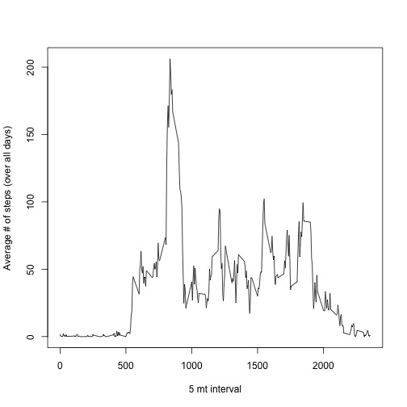
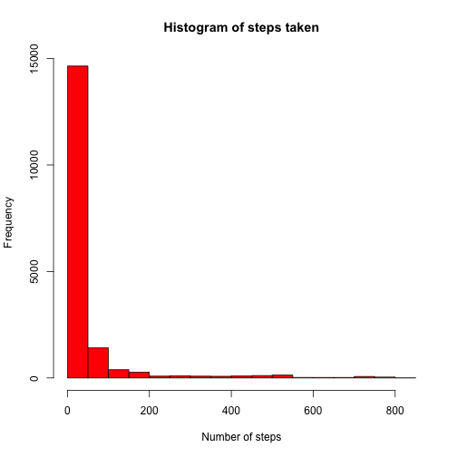

### 5/13/14 ###
# Reproducible Research: Peer Assessment 1


## Loading and preprocessing the data


```r

input <- read.table("activity.csv", sep = ",", header = T)
head(input)
```

```
##   steps       date interval
## 1    NA 2012-10-01        0
## 2    NA 2012-10-01        5
## 3    NA 2012-10-01       10
## 4    NA 2012-10-01       15
## 5    NA 2012-10-01       20
## 6    NA 2012-10-01       25
```

```r
table(input$date)
```

```
## 
## 2012-10-01 2012-10-02 2012-10-03 2012-10-04 2012-10-05 2012-10-06 
##        288        288        288        288        288        288 
## 2012-10-07 2012-10-08 2012-10-09 2012-10-10 2012-10-11 2012-10-12 
##        288        288        288        288        288        288 
## 2012-10-13 2012-10-14 2012-10-15 2012-10-16 2012-10-17 2012-10-18 
##        288        288        288        288        288        288 
## 2012-10-19 2012-10-20 2012-10-21 2012-10-22 2012-10-23 2012-10-24 
##        288        288        288        288        288        288 
## 2012-10-25 2012-10-26 2012-10-27 2012-10-28 2012-10-29 2012-10-30 
##        288        288        288        288        288        288 
## 2012-10-31 2012-11-01 2012-11-02 2012-11-03 2012-11-04 2012-11-05 
##        288        288        288        288        288        288 
## 2012-11-06 2012-11-07 2012-11-08 2012-11-09 2012-11-10 2012-11-11 
##        288        288        288        288        288        288 
## 2012-11-12 2012-11-13 2012-11-14 2012-11-15 2012-11-16 2012-11-17 
##        288        288        288        288        288        288 
## 2012-11-18 2012-11-19 2012-11-20 2012-11-21 2012-11-22 2012-11-23 
##        288        288        288        288        288        288 
## 2012-11-24 2012-11-25 2012-11-26 2012-11-27 2012-11-28 2012-11-29 
##        288        288        288        288        288        288 
## 2012-11-30 
##        288
```

```r
intervals <- unique(input$interval)
days <- unique(input$date)
```


## What is mean total number of steps taken per day?

```r

hist(input$steps, col = "red", xlab = "Number of steps", main = "Histogram of steps taken")
```

 

```r
require(plyr)
```

```
## Loading required package: plyr
```

```r
results <- ddply(input, "date", function(x) {
    data.frame(mean.steps = mean(x$steps, na.rm = F), median.steps = median(x$steps, 
        na.rm = F))
})
head(results)
```

```
##         date mean.steps median.steps
## 1 2012-10-01         NA           NA
## 2 2012-10-02     0.4375            0
## 3 2012-10-03    39.4167            0
## 4 2012-10-04    42.0694            0
## 5 2012-10-05    46.1597            0
## 6 2012-10-06    53.5417            0
```


## What is the average daily activity pattern?

```r

out <- ddply(input, "interval", function(x) {
    data.frame(mean.steps = mean(x$steps, na.rm = T))
})
head(out)
```

```
##   interval mean.steps
## 1        0    1.71698
## 2        5    0.33962
## 3       10    0.13208
## 4       15    0.15094
## 5       20    0.07547
## 6       25    2.09434
```

```r
plot(out$interval, out$mean.steps, type = "l", xlab = "5 mt interval", ylab = "Average # of steps (over all days)")
```

 

```r
subset(out, mean.steps == max(mean.steps))
```

```
##     interval mean.steps
## 104      835      206.2
```

```r
### the 104th 5 minute interval contains the max # steps, averaged over days
```


## Imputing missing values

```r

sum(!complete.cases(input))  ### total number of rows with NAs = 2304 
```

```
## [1] 2304
```

```r
input2 <- merge(input, out, by = "interval")
head(input2)
```

```
##   interval steps       date mean.steps
## 1        0    NA 2012-10-01      1.717
## 2        0     0 2012-11-23      1.717
## 3        0     0 2012-10-28      1.717
## 4        0     0 2012-11-06      1.717
## 5        0     0 2012-11-24      1.717
## 6        0     0 2012-11-15      1.717
```

```r
### fill in NAs with mean for that 5 mt interval
input3 <- subset(data.frame(t(apply(as.matrix(input2), 1, function(x) {
    x[2] = ifelse(is.na(x[2]), x[4], x[2])
    return(x)
})), check.names = F), select = c(steps, date, interval))
input3$steps <- as.numeric(levels(input3$steps))[input3$steps]  #as.integer(input3$steps); 
### the new dataset with missing data filled in !
head(input3)
```

```
##   steps       date interval
## 1 1.717 2012-10-01        0
## 2 0.000 2012-11-23        0
## 3 0.000 2012-10-28        0
## 4 0.000 2012-11-06        0
## 5 0.000 2012-11-24        0
## 6 0.000 2012-11-15        0
```

```r
### check to make sure there are no NAs
sum(!complete.cases(input3))
```

```
## [1] 0
```

```r
hist(input3$steps, col = "red", xlab = "Number of steps", main = "Histogram of steps taken")
```

 

```r
### The frequency in the first bin in the histogram is more, when missing data
### is filled in
results2 <- ddply(input3, "date", function(x) {
    data.frame(mean.steps = mean(x$steps, na.rm = F), median.steps = median(x$steps, 
        na.rm = F))
})
head(results2)
```

```
##         date mean.steps median.steps
## 1 2012-10-01    37.3826        34.11
## 2 2012-10-02     0.4375         0.00
## 3 2012-10-03    39.4167         0.00
## 4 2012-10-04    42.0694         0.00
## 5 2012-10-05    46.1597         0.00
## 6 2012-10-06    53.5417         0.00
```


## Are there differences in activity patterns between weekdays and weekends?

```r

input3$weekday <- weekdays(as.Date(input3$date))
input3$is.weekday <- factor(ifelse(grepl("^s", ignore.case = T, input3$weekday), 
    "weekend", "weekday"), levels = c("weekday", "weekend"))
out2 <- ddply(input3, c("interval", "is.weekday"), function(x) {
    data.frame(mean.steps = mean(x$steps, na.rm = T))
})
head(out2)
```

```
##   interval is.weekday mean.steps
## 1        0    weekday    2.25115
## 2        0    weekend    0.21462
## 3        5    weekday    0.44528
## 4        5    weekend    0.04245
## 5       10    weekday    0.17317
## 6       10    weekend    0.01651
```

```r
require(lattice)
```

```
## Loading required package: lattice
```

```r
out2$interval <- as.numeric(levels(out2$interval))[out2$interval]  #as.numeric(as.character(out2$interval))
xyplot(mean.steps ~ interval | is.weekday, data = out2, layout = c(1, 2), type = "l", 
    ylab = "Average number of steps", xlab = "Interval")
```

 


